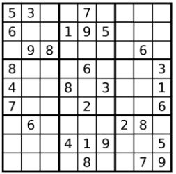

36. Valid Sudoku
---
Determine if a 9x9 Sudoku board is valid, Only the filled cells need to be validated according to the following rules:
1. Each row must contain the digit `1-9` without repetition.
2. Each column must contain the digit `1-9` without repetition.
3. Each of the 9 `3x3` sub-boxed of the grid must contain the digit `1-9` without repetition.



The Sudoku board could be partially filled, where empty cells are filled with character `.`.

**Example 1**
```
Input:
[
    ["5", "3", ".", ".", "7", ".", ".", ".", "."]
    ["6", ".", ".", "1", "9", "5", ".", ".", "."]
    [".", "9", "8", ".", ".", ".", ".", "6", "."]
    ["8", ".", ".", ".", "6", ".", ".", ".", "3"]
    ["4", ".", ".", "8", ".", "3", ".", ".", "1"]
    ["7", ".", ".", ".", "2", ".", ".", ".", "6"]
    [".", "6", ".", ".", ".", ".", "2", "8", "."]
    [".", ".", ".", "4", "1", "9", ".", ".", "5"]
    [".", ".", ".", ".", "8", ".", ".", "7", "9"]
]
Output:
true
```
**Example 2**
```
Input:
[
    ["8", "3", ".", ".", "7", ".", ".", ".", "."]
    ["6", ".", ".", "1", "9", "5", ".", ".", "."]
    [".", "9", "8", ".", ".", ".", ".", "6", "."]
    ["8", ".", ".", ".", "6", ".", ".", ".", "3"]
    ["4", ".", ".", "8", ".", "3", ".", ".", "1"]
    ["7", ".", ".", ".", "2", ".", ".", ".", "6"]
    [".", "6", ".", ".", ".", ".", "2", "8", "."]
    [".", ".", ".", "4", "1", "9", ".", ".", "5"]
    [".", ".", ".", ".", "8", ".", ".", "7", "9"]
]
Output:
false
```

**Note:**
- A Sudoku board (partially filled) could be valid but is not nessesarily solvable.
- Only the filled cells need to be validated according to the mentioned rules.
- The given board contain only digital `1-9` and the character `.`.
- The gived board size is always `9x9`.
